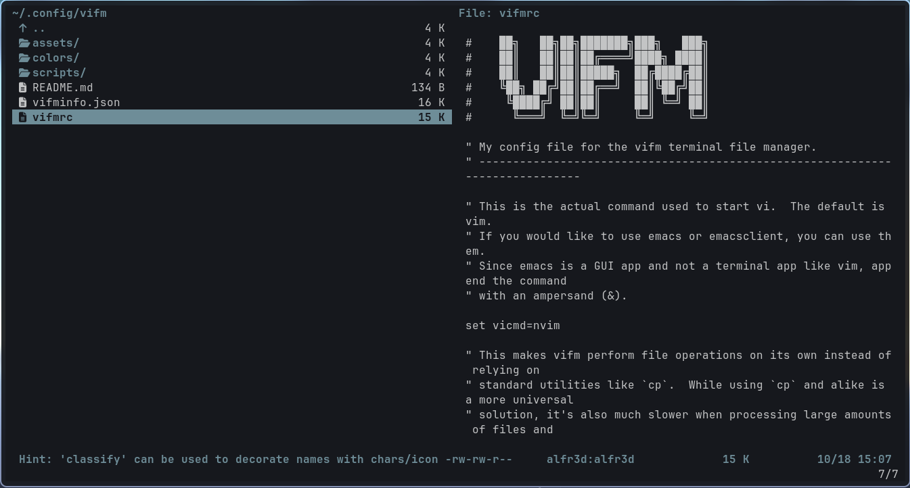

# vifm

Vifm is a file manager with curses interface, which provides Vim-like environment for managing
objects within file systems.
Everyone can use this configuration file to create own vifm configuration.

